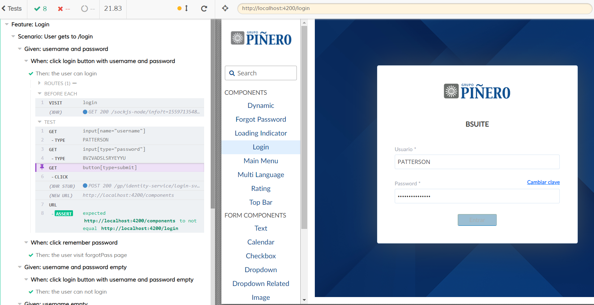
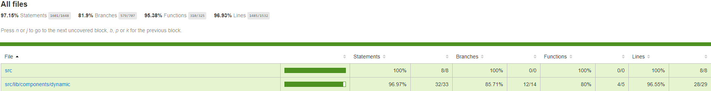

# Testing

This project is whole tested and line coverage is about 90%. In order to do this, the project has several libraries for E2E and unit testing. These, are integrated in the prepush hook, and ran every time before allowing anyone from pushing code with failing tests. 

## E2E
[Cypress.io](https://www.cypress.io/) takes care of this task. Is a very good option within end-to-end testing tools.

You can run the end to end tests with command `npm run e2e`.

Previously, you must run the app (e.g. boilerplate) on localhost:4200.

When executed, cypress opens up a browser tab, and, as if it were an user, will test forms inputs filling data, links, buttons, and any element we want to test.

Cypress offers many advantages over other test frameworks, including the abilities to:
 + Travel through time to dissect the source of a problem when a test fails
 + Automatically record video and screenshots of your tests
 + Easily test in a wide range of screen sizes

 

*Login testing*

## Unit test with Karma
[Karma](https://karma-runner.github.io/latest/index.html) is a tool  which spawns a web server that executes source code against test code for each of the browsers connected. 

Tests results are displayed via command line, based on tests lines written, giving  feedback about the code such which lines fail or pass, and which amount of code are covered by tests. This means, if tests are able to execute a specific percentage of methods and lines of the code. A minimum required percentage could be setting up within karma.config file, in order to set a minimum code quality, less percentage means less quality and lines covered.

## Code coverage
This project uses [Istanbul](https://istanbul.js.org/) as code coverage tool.
> Istanbul instruments your ES5 and ES2015+ JavaScript code with line counters, so that you can track how well your unit-tests exercise your codebase.

*Project codebase coverage*

You can run the unit tests with command `npm run test:lib`

